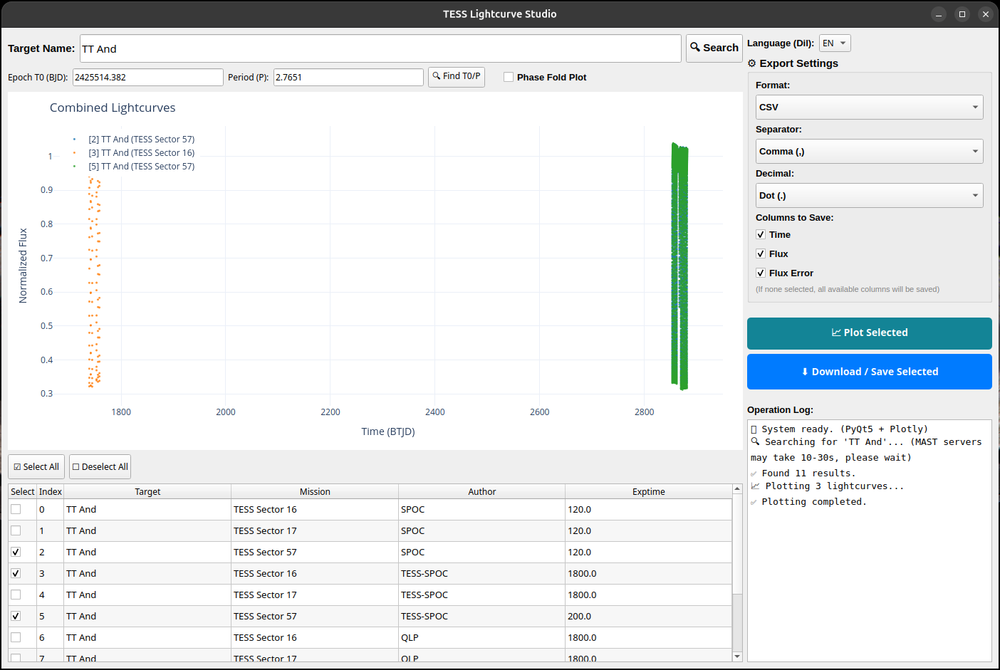
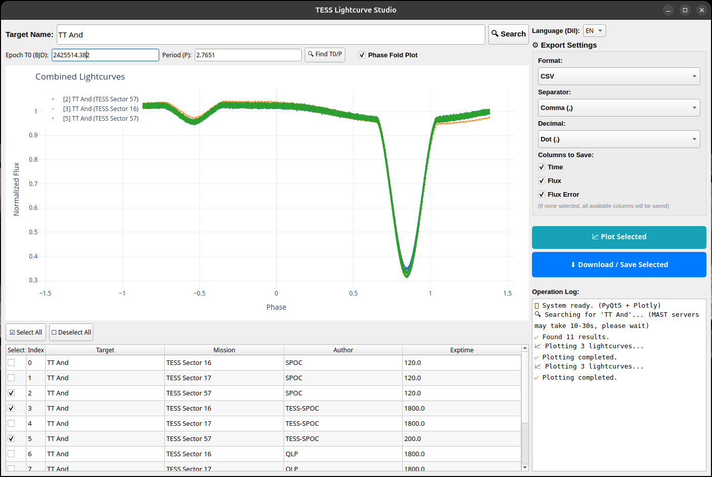

  

# TESS Lightcurve Manager (v2.0)

A desktop tool that allows you to search for TESS (Transiting Exoplanet Survey Satellite) data from MAST servers, preview them on a plot, and batch download them to your computer. **With the new release, the GUI has been completely modernized using PyQt5.**

## Features
- **Multi-Target Search**: Perform multi-target searches with a single click using comma-separated target names.
- **Combined Live Preview**: Powered by Lightkurve and Matplotlib (Qt5), you can smoothly view multiple lightcurves combined on a single anti-aliased plot.
- **Advanced Export Options**: Download data as FITS or in advanced CSV formats where you can customize the separator and decimal character. You can also select specific columns (`time`, `flux`, `flux_err`) to save.
- **Cross-Platform Smooth UI**: Crisp and professional user interface appearance on both Windows and Linux thanks to PyQt5.

## Installation (Developers & Linux/macOS)
Python is required for the project to run:
1. `pip install -r requirements.txt`
2. `python TESS_Araci.py`

*(For a faster Linux or macOS installation, please check the `LINUX_KURULUM.md` document.)*

## 📥 Download Standalone App (No Python Needed!)
For regular users, you can download the compiled standalone desktop application directly:
- **🪟 Windows (10/11)**: Download [TESS_Lightcurve_Studio.exe](https://github.com/ebupi/TESS-Lightcurve-Manager/releases/download/v2.0.0/TESS_Lightcurve_Studio.exe) (Simply run by double-clicking, no install required).
- **🐧 Linux (Ubuntu/Debian)**: Download [tess-lightcurve-studio_2.0_amd64.deb](https://github.com/ebupi/TESS-Lightcurve-Manager/releases/download/v2.0.0/tess-lightcurve-studio_2.0_amd64.deb) (Install using `sudo dpkg -i <file_name>`).
